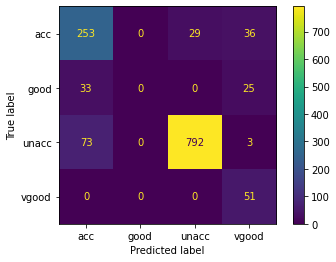
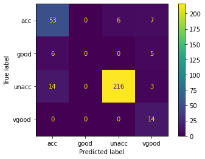
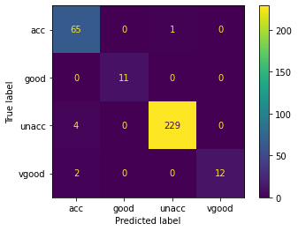

# P04 - Decision Trees

# Task 1
Der beste Split, der für den Baumstumpf gefunden wird ist ('doors', '5more', 'rating').

# Task 2
Der Stump predicted gesamthaft gesehen relativ schlecht, besonders, weil er nur 'unacceptable' als Label predicted. Unter Beachtung davon, dass er aber nur Tiefe 1 hat, ist dies der beste Split, den er wählen konnte, da die meisten Datenpunkte tatsächlich das Label 'unacceptable' haben.

Confusion Matrix Training Data:

```
       acc  good  unacc  vgood
acc      0     0      0      0
good     0     0      0      0
unacc  318    58    868     51
vgood    0     0      0      0
```

Training data accuracy: 0.6702702702702703


Confusion Matrix Test Data:

```
       acc  good  unacc  vgood
acc      0     0      0      0
good     0     0      0      0
unacc   66    11    233     14
vgood    0     0      0      0
```

Test data accuracy: 0.7191358024691358

# Task 3

**Tree with depth 5:**

Confusion Matrix Training Data:

```
       acc  good  unacc  vgood
acc     11     2      7      0
good     0     0      0      0
unacc  305    54    859     49
vgood    2     2      2      2
```

Training data accuracy: 0.6733590733590734

Confusion Matrix Test Data:

```
       acc  good  unacc  vgood
acc      1     0      3      0
good     0     0      0      0
unacc   65    11    229     14
vgood    0     0      1      0
```

Test data accuracy: 0.7098765432098766

**Tree with depth 10:**

Confusion Matrix Training Data:

```
       acc  good  unacc  vgood
acc    207     0     33      6
good     3    45      0      0
unacc  103    11    816      7
vgood    5     2     19     38
```

Training data accuracy:  0.8540540540540541

Die Genaugikeit des Modells erhöht sich mit einer grösseren Baumtiefe auf den Trainingsdaten wie erwartet.

Confusion Matrix Test Data:

```
       acc  good  unacc  vgood
acc     23     4     30      2
good     6     1      6      2
unacc   36     6    186     10
vgood    1     0     11      0
```

Test data accuracy: 0.6481481481481481

Bei der Baumtiefe von 10 ist es jeodch erstaunlich, dass die Test Data Accuracy nur ca. 64% ist. Sie sank also im Vergleich zur Tiefe 5 um fast 6%.

# Task 4

Wenn wir den `DecisionTreeClassifier()` von scikit-learn verwenden, sehen wir, dass dieser einiges besser performed als unsere eigene Implementation:

**DecisionTreeClassifier with depth 5:**

​               Confusion Matrix Training Data:                          Confusion Matrix Test Data:

 


```
Test Data Accuracy Depth 5:
0.8734567901234568
```

Die Prediction accuracy auf den Testdaten erhöht sich von 70.9% auf 87.3% wenn beide Decision Tree Varianten die Maximaltiefe 5 verwenden.

**DecisionTreeClassifier with depth 10:**

Wenn wir die Tiefe auf 10 erhöhen, erhöht sich die Prediction Genaugikeit sogar noch von 87% auf 98% auf den Test Daten.

```
Test Data Accuracy Depth Depth 10:
0.9845679012345679
```

# Task 5

Wenn wir unsere eigene Adaboosted Trees Implementation verwenden mit einem DecisionTreeClassifier als base classifier (Tiefe = 5) erreichen wir eine Testdaten Prediction Accuracy von DecisionTreeClassifier von **0.9876543209876543**.


# Task 6

Um die eigene AdaBoost Implementation mit der von scikit-learn zu vergleichen verwenden wir:

`AdaBoostClassifier(base_estimator=DecisionTreeClassifier(criterion="gini", max_depth=5), random_state=seed, n_estimators=50)`

und erhalten folgenden Confusion Matrizen:

​              Confusion Matrix Training Data:                           Confusion Matrix Test Data:

 

Die Genaugkeit auf den Testdaten ist aber nicht signifikant anders und liegt bei 0.9783950617283951.
